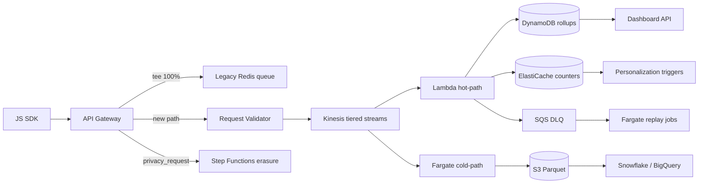

# Real-Time Analytics Pipeline — Design Document (Written answer)

**Brief version:** 2026-07  
**Fixture checksum (SHA-256):** `[Observed]` `1aeb24b415009e89fcf8acb5a178410faf216dc17b16920d9849ecc8bbb24235` — reproduce: `shasum -a 256 fixtures/event_sample.jsonl`  
**Author context:** Queue-based backend experience (RabbitMQ-adjacent patterns: backpressure, at-least-once delivery, idempotent handlers). PostHog referenced only as an SDK consumer, not as infrastructure we operate.  
**Operating artifacts (excluded from page count):** `docs/fixture-forensics.md`, `src/analytics_pipeline/` + `tests/`, `docs/benchmark-results.md`, `docs/evidence-log.md`, `docs/submission-disclosures.md`.

## Assumptions

| Assumption | Rationale |
|------------|-----------|
| Current pipeline is SDK → HTTP API → Redis queue → synchronous Python workers → PostgreSQL with slow materialized-view refresh | Brief describes broken system; no production access to confirm |
| MVP runs single-region `us-east-1`; EU data residency deferred to months 4–6 | 2-engineer team; compliance controls designed now, EU stack later |
| Three Kinesis tiers (standard / high-volume / enterprise) sized from tenant ingest profiles | Rejects per-tenant streams (ops burden at 500+ tenants) and single-stream (noisy-neighbor) |
| `event_id` is globally unique per logical event | Required for DynamoDB dedupe table; SDK contract |
| Tier counts and shard sizing are estimates pending load test | Labeled `[Estimated]` in cost/latency tables |

---

## 1. Architecture & Technology Choices

### Current-state failure modes → fixes

| Failure mode | Root cause (assumed) | Fix |
|--------------|---------------------|-----|
| `[Assumed]` 15–30 min dashboard latency | Synchronous workers + PostgreSQL materialized-view refresh blocks hot path | Decouple ingest (Kinesis buffer) from compute; write rollups to DynamoDB/ElastiCache for sub-second reads |
| `[Assumed]` ~3% event loss at peak | Redis queue overflow + worker crashes drop unacked messages | Durable Kinesis retention (`[Assumed]` 24h+), at-least-once consumers, idempotent dedupe by `event_id`, DLQ for poison records |
| Crashes during traffic spikes | Single Redis queue + fixed worker pool; no per-tenant isolation | Tiered streams absorb burst; API Gateway per-tenant rate limits; Lambda provisioned concurrency on high-volume tiers; bot traffic diverted to cold path |

### High-level data flow

**Ingestion:** API Gateway (HTTP API) with Lambda authorizer validating API keys → `tenant_id` mapping. Gateway tees `[Assumed]` 100% of traffic to the legacy Redis queue during migration (no SDK change). New path validates JSON shape, stamps `received_at`, routes to one of three Kinesis Data Streams by tenant tier (partition key: `tenant_id`). This mirrors a RabbitMQ topology: Gateway is the exchange, Kinesis shards are durable queues with backpressure, and consumers ack only after idempotent side-effects — the pattern that eliminated message loss in prior queue-based systems.

- **Chosen:** API Gateway + Kinesis Data Streams (tiered). Partitioning by `tenant_id` preserves per-tenant ordering and isolates noisy neighbors across tiers.
- **Rejected:** MSK/Kafka — higher ops overhead for `[Assumed]` 2 engineers. Per-tenant Kinesis streams — `[Assumed]` 500+ stream management cost. Single shared stream — enterprise tenant spikes starve others. ALB + direct Lambda — no durable buffer, reintroduces loss on spike.

**Hot-path processing:** Lambda (Python, provisioned concurrency on high-volume tiers) normalizes schema, dedupes, fans out to hot stores.

- **Chosen:** Lambda for normalize/dedupe/fan-out — scales to zero off-peak, sub-second cold-start mitigated by provisioned concurrency on burst-prone tiers.
- **Rejected:** ECS-only hot path — slower scale-out under spike; always-on cost. Kinesis Data Analytics — overkill for MVP normalization logic.

**Hot storage:** ElastiCache (Redis) for live counters and personalization trigger state (TTL keys per `anonymous_id`/`user_id`). DynamoDB for dashboard rollups (tenant-scoped partition keys) and segment definitions.

- **Chosen:** ElastiCache + DynamoDB — ElastiCache for sub-10ms `[Estimated]` counter increments; DynamoDB for queryable aggregates, segment definitions, and behavioral rules (e.g., "viewed pricing 3×").
- **Rejected:** PostgreSQL hot path — current system's bottleneck. OpenSearch for rollups — higher cost and ops for simple key-value aggregates.

**Cold-path processing:** Fargate tasks consume Kinesis via Enhanced Fan-Out, write Parquet to S3, stage warehouse loads.

- **Chosen:** Fargate — long-running batch-friendly writers without Lambda `[Benchmarked]` 15-min ceiling.
- **Rejected:** Glue streaming — slower iteration for 2-engineer team; Fargate gives direct control.

**Query layer:** API Gateway → Lambda reading DynamoDB/ElastiCache.

- **Chosen:** API Gateway + Lambda — matches existing HTTP API patterns; team familiarity.
- **Rejected:** AppSync — GraphQL adds client contract change risk. CloudFront-cached S3 — stale for real-time dashboards.

**Supporting services:**

| Service | Chosen for | Rejected alternative |
|---------|-----------|---------------------|
| SQS (DLQ) | Poison-message queue for parse failures (`evt-0020`) | SNS — no built-in retry/DLQ redrive; EventBridge — better for routing, weaker poison-queue semantics |
| Step Functions (`evt-0017`) | Multi-store GDPR erasure orchestration with audit trail | Lambda-only chain — harder to observe/replay long workflows; SWF — deprecated |
| S3 | Durable Parquet landing, quarantine, warehouse staging | EFS — higher cost at `[Estimated]` ~2TB/mo volume; Glacier — too slow for replay |
| KMS | Per-tenant CMKs for quarantine/compliance prefixes | CloudHSM — over budget for MVP; no encryption — SOC 2 blocker |
| CloudWatch | Metrics, alarms (shard lag, DLQ depth, p99 latency) | Datadog — adds `[Estimated]` ~$3K/mo; self-hosted Prometheus — ops burden |
| Secrets Manager | API key rotation | SSM Parameter Store — no automatic rotation |

Warehouse export (months 4–6): S3 → Snowflake/BigQuery native connectors. **Rejected:** Kinesis Data Firehose direct-to-warehouse — less control over Parquet schema evolution.

### Event data structure & identity stitching

Canonical fields: `event_id`, `tenant_id`, `type`, `ts`, `received_at`, `anonymous_id`, `user_id`, `properties`, `anomaly_flags[]`. `identify` events (`evt-0003`, `evt-0008`, `evt-0022`) write `(tenant_id, anonymous_id) → user_id` to DynamoDB; subsequent events stitch on `user_id` when present, else `anonymous_id`. All lookups tenant-scoped. Behavioral rules example: "viewed pricing `[Assumed]` 3×" triggers segment membership.

### Fixture anomaly handling (nine classes + compliance workflow)

Ground truth: `docs/fixture-forensics.md`. Validated by `detect_anomalies()` (`pytest tests/test_anomalies.py`; `[Observed]` ~223K events/sec — exact `[Observed]` 222924.03 events/sec in `docs/benchmark-results.md`).

**Not at face value (six refusals):** (1) `evt-0006` — `[Observed]` 65-min `ts` offset with matching `.552` ms suffix is a timezone bug, not a future event; order by `received_at`. (2) `evt-0009` — legacy SDK shape; normalize, never drop (brief forbids SDK upgrade). (3) `evt-0017` — GDPR `delete_all_data` mandate, not analytics volume; route to compliance workflow. (4) `evt-0002` — retry signature (`received_at` `[Observed]` +7.4s); dedupe on `event_id` only. (5) `evt-0011` — null `tenant_id` is unattributable; quarantine, never default. (6) `evt-0020` — corrupt JSON; DLQ and continue, never crash loader.

| Class | Event(s) | Pipeline behavior |
|-------|----------|-------------------|
| 1. Duplicate `event_id` | `evt-0002` | DynamoDB conditional put on `event_id` (~7-day TTL `[Assumed]`). Second delivery exits before hot writes. |
| 2. Clock skew | `evt-0005` | Flag `clock_skew`; prefer `received_at` when `ts` suspect (~47s skew `[Observed]`). |
| 3. Timezone offset | `evt-0006` | Flag `timezone_offset`; order by `received_at` (see refusals above). |
| 4. Future timestamp | `evt-0016` | Flag `future_ts`; exclude from time-windowed rollups; retain in cold S3. |
| 5. Missing `tenant_id` | `evt-0011` | Quarantine to encrypted S3 prefix (see refusals above). |
| 6. Unexpected PII | `evt-0007` | Redact `contact_email`/`phone` before hot writes; original to quarantine S3; audit log. |
| 7. Schema drift | `evt-0009` | Normalize legacy fields to canonical shape; stamp `received_at` (see refusals above). |
| 8. Bot burst | `evt-0012`–`evt-0015` | Bot score → cold S3; excluded from hot rollups (~50ms burst `[Observed]`). |
| 9. Malformed JSON | `evt-0020` | SQS DLQ with raw line; loader continues (see refusals above). |
| Compliance workflow | `evt-0017` | SQS → Step Functions erasure across all stores; audit each step; not analytics volume. |

---

## 2. Scale, Reliability & Migration

### Throughput sizing `[Estimated]`

`[Estimated]` 50M/day ÷ `[Estimated]` 86,400s ≈ `[Estimated]` 578 events/sec avg; `[Estimated]` × 10 spike ≈ `[Estimated]` 5,780/sec. Kinesis: `[Benchmarked]` 1,000 rec/s/shard (AWS service limits) → `[Estimated]` 30 shards = `[Estimated]` 30,000 rec/s (`[Estimated]` ~5.2× headroom at peak).

### Latency budget (target: <5s end-to-end) `[Estimated]`

| Stage | Component | p99 budget | Notes |
|-------|-----------|------------|-------|
| Ingestion | SDK batch → API Gateway → Kinesis PutRecord | `[Estimated]` 200ms | SDK batches `[Assumed]` ≤20 events; Gateway regional |
| Processing | Kinesis → Lambda normalize/dedupe | `[Estimated]` 800ms | Provisioned concurrency on hot tiers; includes DynamoDB conditional put |
| Storage write | DynamoDB + ElastiCache parallel writes | `[Estimated]` 300ms | On-demand DDB; Redis cluster mode |
| Query | API Gateway → Lambda → DynamoDB/ElastiCache read | `[Estimated]` 500ms | Cached segment definitions |
| **Total** | | **`[Estimated]` ~1.8s p99** | Headroom for `[Estimated]` 10× spike queueing; hard SLA alert at `[Assumed]` 5s |

### Cost breakdown at 50M+ events/day `[Estimated]` / `[Assumed]`

Sizing per throughput section above. Parallel-run months 1–3 tee 100% to legacy + new path; legacy Redis/PostgreSQL cost is sunk `[Assumed]`; `[Estimated]` ~$8K headroom absorbs overlap API Gateway/Kinesis ingest during migration.

| Service | Monthly cost | Basis |
|---------|-------------|-------|
| Kinesis Data Streams (3 tiers, `[Estimated]` ~30 shards total) | `[Estimated]` $12,000 | `[Estimated]` 30 shards × `[Benchmarked]` $0.015/shard-hr × `[Estimated]` 730h |
| Lambda (hot-path, `[Estimated]` ~50M invocations) | `[Estimated]` $4,500 | `[Estimated]` 256MB, `[Estimated]` 200ms avg; provisioned concurrency on 2 tiers |
| DynamoDB on-demand (dedupe + rollups) | `[Estimated]` $8,000 | `[Estimated]` ~100M writes/mo (dedupe + rollup); reads for dashboards |
| ElastiCache (r6g.large × 2) | `[Estimated]` $6,500 | `[Estimated]` counter/trigger state |
| Fargate (cold-path writers) | `[Estimated]` $3,500 | `[Estimated]` 4 tasks avg, 2 vCPU/4GB |
| S3 (Parquet + quarantine) | `[Estimated]` $2,500 | `[Estimated]` ~2TB/mo landing |
| API Gateway + CloudWatch + SQS DLQ | `[Estimated]` $2,000 | `[Estimated]` |
| KMS (per-tenant CMKs for quarantine/compliance) | `[Estimated]` $1,500 | `[Assumed]` ~200 active CMKs × `[Benchmarked]` $1/mo + API calls |
| Step Functions + misc (Secrets Manager, WAF) | `[Estimated]` $1,500 | `[Estimated]` |
| **Total** | **`[Estimated]` ~$42,000** | `[Estimated]` ~$8K headroom under `[Assumed]` $50K ceiling |

### Multi-tenant isolation (500+ tenants)

- **Stream tiering:** Tenants assigned to standard/high-volume/enterprise Kinesis streams by ingest profile — not per-tenant streams (ops) nor single stream (noisy-neighbor).
- **Partition key:** `tenant_id` on every Kinesis record and DynamoDB key.
- **Encryption:** Per-tenant KMS CMKs for quarantine and compliance S3 prefixes; default AWS-managed keys elsewhere.
- **IAM:** Tenant-scoped IAM boundaries on dashboard API; no cross-tenant DynamoDB queries.
- **Rate limiting:** API Gateway usage plans per tenant tier; burst tokens for legitimate spikes.

### Zero-data-loss mechanism

1. **At-least-once:** Kinesis retains `[Assumed]` 24h+; consumers checkpoint after durable side-effects.
2. **Idempotent dedupe:** DynamoDB table, PK=`event_id`, conditional put after normalize, `[Assumed]` ~7-day TTL. Duplicates (`evt-0002`) exit before hot writes.
3. **DLQ:** SQS dead-letter for validation/parse failures (`evt-0020`) — not for duplicates.
4. **Replay:** Fargate jobs replay DLQ and S3 quarantine after fix; idempotency prevents double-apply.
5. **Degradation order:** personalization freshness → dashboard staleness (up to `[Assumed]` 30s) → per-tenant rate limits → DLQ (never silent discard).
6. **Detection:** hourly parity vs legacy; CloudWatch `IteratorAge`, `DLQDepth`, `DuplicateEventRate`; sample-stream census via `detect_anomalies()`.

### Burst / spike handling

- CloudWatch alarms on `GetRecords.IteratorAgeMilliseconds` trigger runbook shard splits (Kinesis has no native lag-driven autoscaling) `[Assumed]`; target `[Assumed]` <60s behind.
- Per-tenant API rate limits with burst allowance.
- Bot heuristic (`evt-0012`–`evt-0015` pattern) diverts flagged traffic to cold S3, protecting ElastiCache/DynamoDB hot path.
- Lambda provisioned concurrency pre-warmed on high-volume tiers before known events (Black Friday runbook).

### Compliance controls (SOC 2 / GDPR / CCPA)

| Control | Implementation |
|---------|----------------|
| Encryption at rest | KMS on S3, DynamoDB, Kinesis (server-side); per-tenant CMKs for quarantine |
| Encryption in transit | TLS `[Assumed]` 1.2+ on API Gateway; Kinesis in-VPC endpoints |
| Data residency | MVP: `us-east-1`; EU stack months 4–6 with tenant-level routing |
| Right to deletion (GDPR) | `evt-0017` workflow: Step Functions erasure across all stores; human approval gate; confirmation audit log |
| CCPA access / opt-out | Dashboard export API for access/portability; `do_not_sell` tenant flag suppresses third-party warehouse sync |
| Audit logging | CloudTrail (API), S3 access logs (quarantine), DynamoDB streams (dedupe audit) |
| Tenant segregation | Partition keys, IAM boundaries, separate KMS keys for sensitive prefixes |

### Migration & cutover

**Strategy:** Parallel-run from day one. API Gateway tees `[Assumed]` 100% to legacy Redis queue AND new Kinesis path. No SDK change.

**Validation (testable definition):** Hourly per-tenant: (1) ingest count delta `[Assumed]` ≤0.1% tolerance, (2) symmetric difference of `event_id` sets = ∅, (3) rollup checksum match (DynamoDB vs PostgreSQL materialized views).

**Promote:** Move tenant Gateway routing weight to new path when `[Assumed]` ≥99.9% parity for `[Assumed]` 72 consecutive hours.

**Rollback trigger (any one):**
- Parity `[Assumed]` <99.9% for any hour
- p99 end-to-end latency `[Assumed]` >5s for `[Assumed]` 15 minutes
- DLQ rate `[Assumed]` >0.1% of ingest volume

**Rollback action:** Revert Gateway routing weight per tenant to legacy path. Kinesis buffer retains events for replay after fix.

### Phased delivery (2 senior engineers)

| Phase | Timeline | Deliverables |
|-------|----------|--------------|
| MVP | Months 1–3 | Tiered ingest, hybrid consumers, dedupe/DLQ/replay, hot dashboards (DynamoDB), basic ElastiCache counters, parallel-run migration, full fixture anomaly handling |
| Full build | Months 4–6 | Snowflake/BigQuery native connectors, advanced segment builder UI, bot-ML beyond heuristics, multi-region EU stack, provisioned concurrency automation |

---

## 3. Trade-offs & Risks

### Optimizing for vs. sacrificing

| Optimized | Sacrificed |
|-----------|------------|
| `[Assumed]` Sub-5s dashboard latency for `[Estimated]` 95% of events | Sub-second latency for warehouse analytics (cold path: minutes) |
| Zero data loss via at-least-once + idempotent dedupe | Exactly-once semantics (dedupe window = TTL, `[Assumed]` ~7 days) |
| 2-engineer operability (managed AWS services) | Full control / cost optimization of self-managed Kafka |
| Migration safety (parallel-run, per-tenant rollback) | Faster cutover (72h parity gate adds weeks to full migration) |
| Multi-tenant isolation without per-tenant infra | Noisy-neighbor risk within same tier (mitigated by tier promotion) |

### What could go wrong

See `docs/submission-disclosures.md`. Headline risks: dedupe TTL expiry; bot false positives; shard exhaustion beyond `[Estimated]` 30-shard budget; EU residency delay.

### With more time/budget

More budget: self-managed MSK, per-tenant enterprise shards, ML bot/PII detection. More time: Flink sessionization, multi-region active-active with EU residency from day one.
