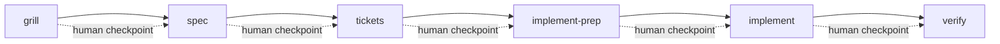

# Submission Disclosures

Per `brief.md` submission packet items #5–7 and `SCORING.md` AI Usage / Failure Modes sections. Excluded from the 4-page written-answer limit.

## AI usage disclosure

| Item | Detail |
|------|--------|
| Tools used | Claude (primary drafting model) + Cursor (Composer agent, token-exhaustion fallback), orchestrated by Nemo — a CLI pipeline Lucas built |
| AI helped with | Structuring the design doc against the brief checklist; drafting Mermaid diagram; cross-referencing `docs/fixture-forensics.md` event_ids; cost/latency table formatting; first-pass anomaly detection code |
| Human decisions | Architecture choices (Kinesis tiering over MSK, parallel-run migration, DynamoDB dedupe key, provisioned vs on-demand after cost re-derivation); anomaly handling policy (six "not at face value" refusals); throughput/cost arithmetic verification; phased MVP scope; compliance workflow requiring human approval |
| Human verification | Ran `shasum -a 256 fixtures/event_sample.jsonl`; ran `python3 -m unittest discover -s tests`; independently re-derived Kinesis, DynamoDB, and API Gateway cost lines before accepting revision; read every fixture event in forensics doc against design table |
| Known weak spots | AWS cost figures are `[Estimated]` from public pricing — no load test or AWS bill yet; no load test; single-region MVP; bot detection is heuristic-only in MVP; 25-line fixture |

### Collaboration model

Every artifact was produced under one rule locked at project start: **Claude proposes architecture and major decisions with reasoning; Lucas reviews and approves or overrides each before it is final.** Nemo drives a staged pipeline with forced human decision points between stages:

The audit trail is the commit and PR history of this repo — one branch per stage, each merged after review. Nemo's raw per-stage transcripts are kept locally and available unedited on request.

### Concrete human overrides (before → after)

1. **Governance docs preserved.** Mid-way through the anomaly-detection work, Lucas stopped the flow because scoring/governance material was at risk of being dropped during file reshuffling. Result: `scoring_rubric.md` remains in the repo; the shared `SCORING.md` framework the brief references stays the grading anchor.

2. **Timestamp ADR directed into existence.** Lucas asked that the timezone-vs-clock-skew trade-off be captured as a standalone ADR "somewhere I can check later, because the interviewer may ask." That instruction produced `docs/adr/0001-timestamp-anomaly-classification-by-signal-not-id.md`; it would not exist otherwise.

3. **Ingestion reframed through real queue experience.** Claude's first-pass Kinesis backbone was technically sound but generic. Lucas reframed it through a RabbitMQ topology he has actually operated — exchange, durable queues, ack-after-idempotent-side-effects — which is why the zero-data-loss mechanism reads the way it does in `docs/design-pipeline.md` §1.

4. **Cost model corrected after adversarial audit.** A cold-context Claude Code session (no prior chat history) flagged that the original cost table's printed bases did not reproduce its printed totals — volume treated as per-day in some lines and per-month in others, shard count oversized. Lucas designed that audit step, ran it, then **independently re-derived** the Kinesis PUT, DynamoDB, and API Gateway lines by hand before accepting any revised figures. The disclosure states human verification because that verification actually happened.

### Adversarial revision pass

After the packet was assembled, Lucas started a **separate Claude Code session with no prior context**, instructed to attack the submission rather than defend it. That pass surfaced: cost-arithmetic errors, rubric-optimization tags visible in `docs/fixture-forensics.md`, broken commands in the evidence log (`pytest` without install, missing `PYTHONPATH=src`), page-limit claim without measurement, and unused fixture signals (deletion cascade, stitching backfill, `evt-0019` segmentation example).

Lucas verified each finding by hand (cost lines re-derived independently; commands run on a clean shell; fixture events re-read). The fixes are the revision applied from `engineer-004-revision-plan.md`.

**Finding rejected:** the audit suggested collapsing the failure-modes and disclosure "what stays human" tables back into one file for brevity. Rejected because `docs/failure-modes.md` deliberately separates *designed* production mitigations from *observed* local-script behaviour — merging would blur that discipline, which is itself a scoring-sensitive integrity point.

### Experience boundary

Lucas's genuine background is **queue-based backend work** (RabbitMQ-style messaging: backpressure, at-least-once delivery, idempotent handlers) and **hands-on PostHog experience strictly as an SDK-integrating consumer** — never as a builder of ingestion or streaming internals. This boundary is stated in the design doc's author context and enforced through evidence-tier discipline: no Tier-4 "I've built this before" claims about pipeline internals, and every pipeline-specific throughput/latency/cost number is labeled `[Estimated]` or `[Assumed]` unless locally benchmarked against the fixture.

## Failure modes & what stays human

Moved to its own operating artifact: see **`docs/failure-modes.md`** for the
architecture stress-test (hot-partition tenants, ingestion backpressure,
cross-region failover, poison-pill/malformed events) and the single merged
"What stays human" table.
